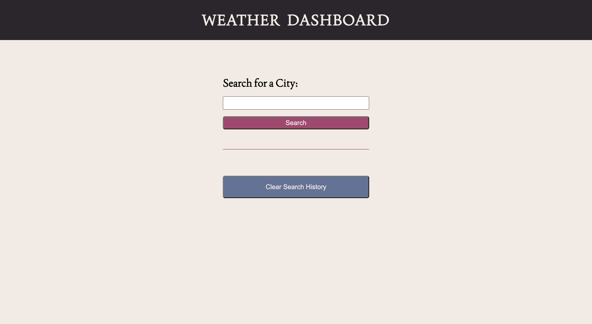
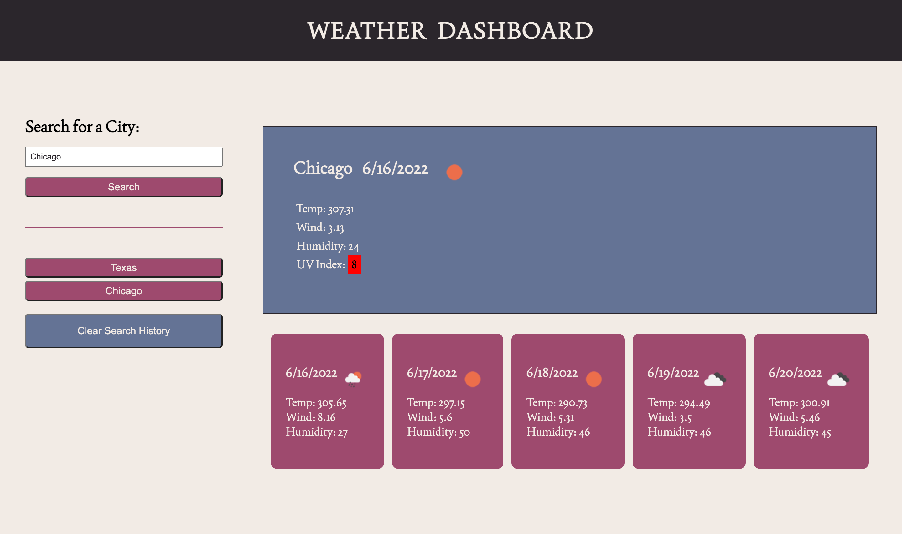
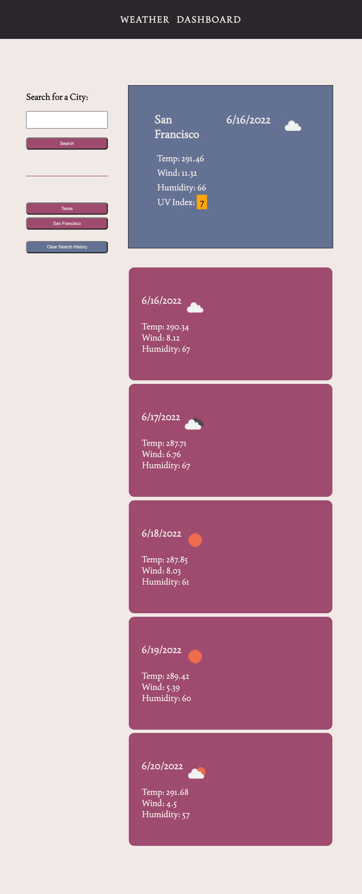

# US Weather Forecast Dashboard

## Project Description

This is US specific weather forecast dashboard as country code is not being usedin API call and even if the same city exist in
multiple states ,only one from the search is picked
 

User is presented with a search box and button to search for city name and additional option to clear search history.
When user enter the city name and click Search,verifies if the city name is not empty using isValid()
Verifies if city is not already part of local storage and only if not creates a new button with city name and add to search history
Also displays current and 5 day weather forecast.
As per documentation,used the updated One call API and geocoding API ,first to fetch coordinates with city name
and then to search with coordinates for weather details.
 

When user clicks on buttons on search history ,only one API call happens with coordinates to get updated weather data
When user clicks on Clear search histor,local storage is cleared and UI is updated

### User Story
 
AS A traveler I WANT to see the weather outlook for multiple cities SO THAT I can plan a trip accordingly

### Acceptance Criteria
 

GIVEN a weather dashboard with form inputs
* WHEN I search for a city THEN I am presented with current and future conditions for that city and that city is added to the search history
* WHEN I view current weather conditions for that city THEN I am presented with the city name, the date, an icon representation of weather conditions, the temperature, the humidity, the wind speed, and the UV index
* WHEN I view the UV index THEN I am presented with a color that indicates whether the conditions are favorable, moderate, or severe
* WHEN I view future weather conditions for that city THEN I am presented with a 5-day forecast that displays the date, an icon representation of weather conditions, the temperature, the wind speed, and the humidity
* WHEN I click on a city in the search history THEN I am again presented with current and future conditions for that city

## Links

*  Repo Link : https://github.com/simmypayyappillyvarghese/us-daily-weather-forecast-dashboard
*  Live Link : https://simmypayyappillyvarghese.github.io/us-daily-weather-forecast-dashboard/

## Technologies Used

* [x] HTML5
* [x] CSS3
* [x] JQUERY

## APIS Used

Open Weather APIs

* GeoCoding Direct API
* Current and Forecast Weather API

## Screenshots

Below is the starting page of weather dashboard
;

 

Below is the weatehr forecast page of dashboard
;

 

Below is the mobile view of weather dashboard
;
